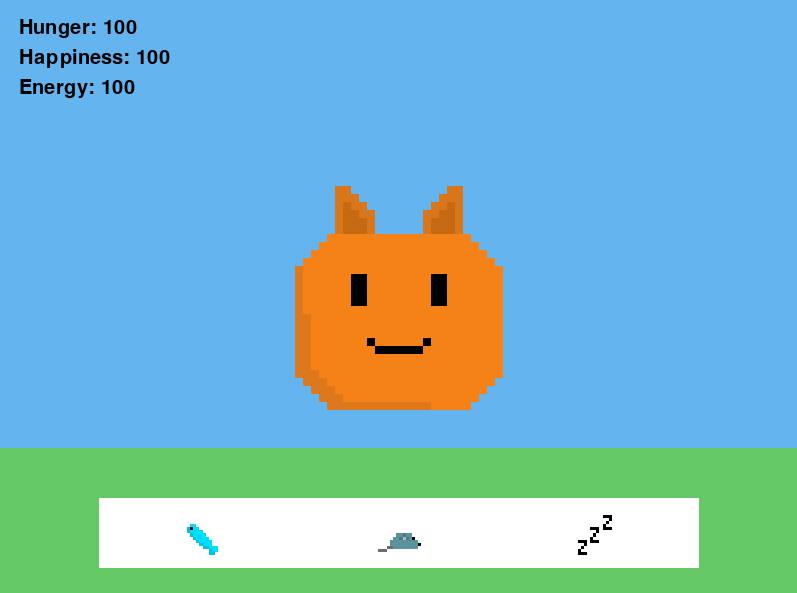

# PIXL Pet

PIXL Pet is a small virtual pet game made with Python and Pygame.

Take care of PIXL by feeding, playing and letting PIXL sleep. Keep the stats high and make sure PIXL stays alive.

## Game



## Stats

PIXL has 3 stats:

- Hunger
- Happiness
- Energy

You need to keep these stats high to keep PIXL alive.

## Actions

### Feed

Give PIXL some food to increase hunger.

### Play

Play with PIXL to increase happiness.

Playing also uses energy.

### Sleep

Let PIXL sleep to increase energy.

Sleeping also decreases hunger.

## Death

If hunger or energy reaches 0, PIXL dies.

When PIXL dies, the buttons disappear and a respawn button appears.

Click the respawn button to start again with all stats at 100.

## Build Locally

### Requirements

You need:

- Windows
- Python 3.13 or newer
- Git
- Pygame
- PyInstaller

### 1. Clone the repository

Open PowerShell and run:

```powershell
git clone https://github.com/its-noid-dev/pixlpet.git


Then enter the project folder:

cd pixlpet
2. Create a virtual environment

Create a Python virtual environment:

python -m venv .venv
3. Activate the virtual environment

Activate the virtual environment:

.\.venv\Scripts\Activate.ps1

If activation worked, you should see (.venv) at the start of your PowerShell line.

4. Install Pygame

Install Pygame:

pip install pygame
5. Run PIXL Pet

Start the game with:

python main.py

The PIXL Pet game window should open.

Build the Windows .exe
1. Install PyInstaller

Install PyInstaller inside the virtual environment:

pip install pyinstaller
2. Build the .exe

Run:

pyinstaller --onefile --windowed --add-data "assets;assets" main.py

PyInstaller will create a build folder, a dist folder and a .spec file.

3. Find the .exe

The finished Windows executable will be located at:

dist/main.exe

You can double-click main.exe to start PIXL Pet without opening Python.
